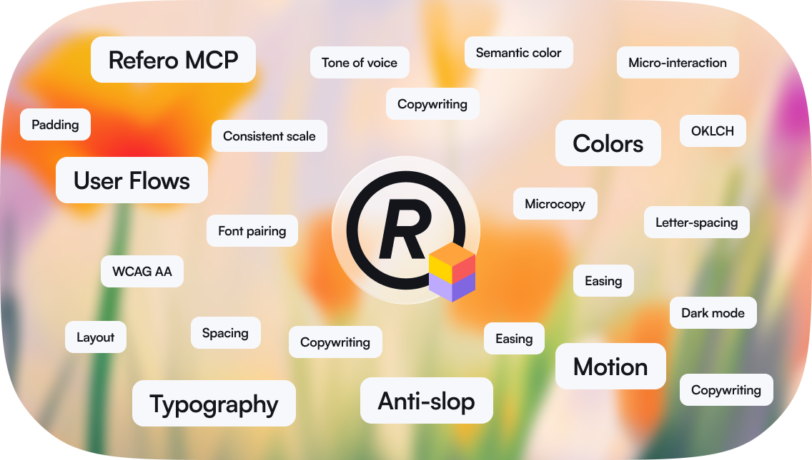

# Refero Skill

An agent skill that gives your AI access to 150,000+ real app screens and 6,000+ user flows from Stripe, Linear, Notion, Figma, and the best-designed products ever built — plus craft knowledge on typography, color, and copywriting. Your agent researches real references before designing, not training data averages.

## Install

Works with Claude Code, Cursor, Gemini CLI, Lovable, and any MCP-compatible agent.

```bash
npx skills add referodesign/refero_skill
```

Craft knowledge loads immediately. No account required.

<details>
<summary>Manual installation</summary>

```bash
git clone https://github.com/referodesign/refero_skill.git ~/.claude/skills/refero-design
```

On Claude.ai, add the contents of `SKILL.md` to your project knowledge.

</details>

---

## What it does

1. **Searches real products** — finds relevant screens and user flows across 150,000+ products from Stripe, Linear, Notion, Figma, and thousands more. Every result includes metadata on components, typography, colors, and layout — not just images. _(Requires [Refero Pro](#unlock-live-design-research))_
2. **Extracts patterns** — identifies specific design decisions and builds a reference list before touching code.
3. **Applies craft knowledge** — uses built-in guides on typography, color, spacing, motion, icons, and copywriting. Flags anti-slop patterns before they appear.
4. **Designs with evidence** — every decision traces back to a real product or a craft rule, not a training data average.

<details>
<summary>Files</summary>

`SKILL.md` — Research-First methodology: discovery questions, research strategies, analysis frameworks, quality gates.

Reference guides: `typography.md`, `color.md`, `motion.md`, `icons.md`, `craft-details.md`, `anti-ai-slop.md`, `copywriting.md`, `mcp-tools.md`, `example-workflow.md`

</details>

---

## Unlock live design research

Get Refero Pro at [refero.design/mcp](https://refero.design/mcp), then connect your tool:

<details>
<summary>Claude Code</summary>

```bash
claude mcp add --transport http refero https://api.refero.design/mcp --header "Authorization: Bearer <token>"
```

</details>

<details>
<summary>Cursor</summary>

Add to `.cursor/mcp.json`:
```json
{
  "mcpServers": {
    "refero": {
      "url": "https://api.refero.design/mcp",
      "headers": { "Authorization": "Bearer <token>" }
    }
  }
}
```

</details>

<details>
<summary>Gemini CLI</summary>

```bash
gemini mcp add --transport http refero https://api.refero.design/mcp --header "Authorization: Bearer <token>"
```

</details>

<details>
<summary>Lovable</summary>

Settings → Connectors → New MCP server → `https://api.refero.design/mcp` → Bearer token

</details>

<details>
<summary>Other tools</summary>

```
URL: https://api.refero.design/mcp
Auth: Bearer <token>
```

</details>

The first time you call Refero, a browser window opens to sign in. After that it's automatic.

## Contributing

To add a new skill, create a directory under `skills/` with a `SKILL.md` file following the [Agent Skills](https://agentskills.io/) format.

## License

MIT
